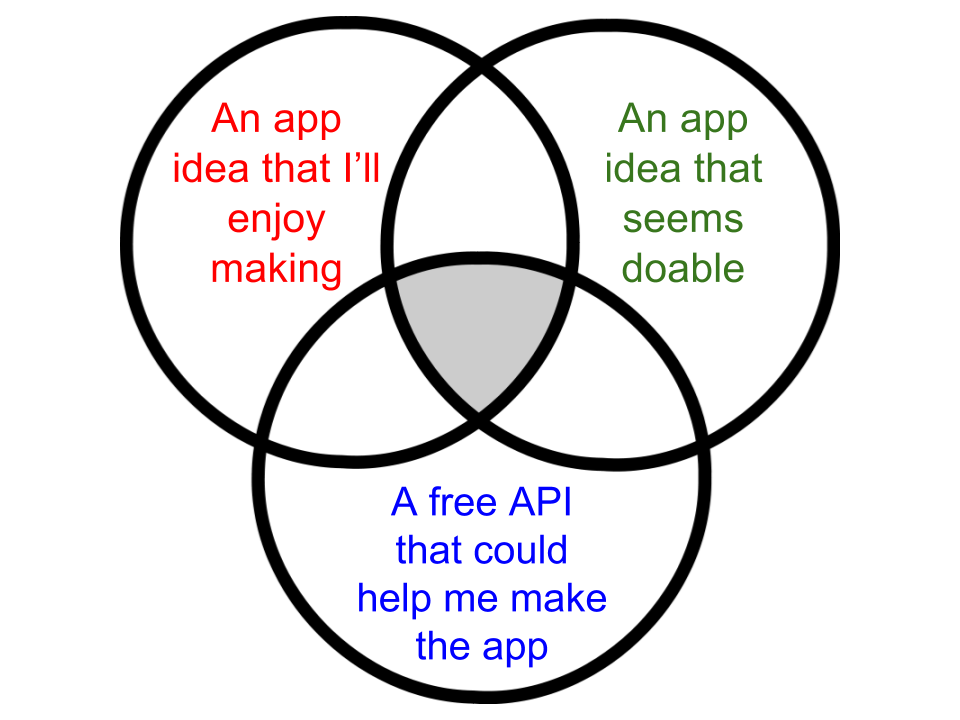

# Entry 1: Intro / Plan

I have spent the past several weeks going through the Flatiron School Prework in preparation to be a Precollege Instructor for their software engineering summer camp.  I have reviewed and expanded on my knowledge of HTML/CSS/JS, but I have especially enjoyed learning Ruby and Sinatra.  At the very end of the Teacher Bootcamp, we briefly saw what is possible with the Giphy API.  I love the simple app ideas that are possible with Ruby and Sinatra, but I caught a glimpse of the realm of APIs and I want to learn more.  The Flatiron School's curriculum for learning Ruby and Sinatra has been fantastic, but they don't have much on APIs.  So I am deciding to take my learning into my own hands and learn as much as I can about APIs by myself.  

## What is an API?

Ok, let's start with the basics.  I learned that API stands for **A**pplication **P**rogramming **I**nterface.  My understanding of it is than an API is meant to be a sort of "tunnel" into an application.  This sounds like a sneaky way of hacking into someone's app, but it's not.  An API is built *by* the people who write the code for the app (not someone trying to hack into it).

For example, Google Maps has an API that allows you to use their service on your own app. So apps like Airbnb don't have to reinvent the wheel to make their own apps; they can plot their users' vacation homes and apartment rentals right onto a Google Map, completely integrated into their site.  Neat!

In an effort to broaden my understanding of APIs, I looked at tons of examples.  The Zillow API lets developers access all sorts of information about real estate.  The MTA API lets developers access real-time data feeds.  Ok, this is pretty cool.

## The hunt for an app idea

Because I have been a teacher for a while and a learner for much longer, I know that I learn the most by doing.  So I am deciding early on that I need to do much more than simply read tutorials and documentation; I need to make something.

I spent a while trying to find the intersection between:



As I browsed APIs, I had lots of ideas for apps that landed in an intersection between 2 circles:

- An app that takes in a user's Spotify playlist and filters out custom lyrics.
  - I would definitely enjoy doing this.
  - There is a Spotify API and lots of lyric APIs out there.
  - This seems like a beast of an app to make for my first project.  Maybe later after I tackle something easier.
- An app that takes in a zip code and a max home price and gives back a list of homes in that area.
  - The Zillow API seems pretty robust.
  - I don't think I'd be biting off more than I can chew.
  - But I think I would lose motiviation if this becomes difficult.  Maybe I'll be more interested in making this sort of app when I'm thinking about buying a home.
- An app that takes in a type of furniture and a color and gives back options from IKEA.
  - Seems simple.
  - Seems interesting.
  - There doesn't seem to be an API for this.  The closest I could find was to use the idea of web scraping (which I haven't learned -- maybe that will be another independent study).

But then the perfect app idea hit me in the middle of the venn diagram trifecta.

## The Green Glass Door

I love riddles.  More importantly, my students love riddles.  One of my favorites goes like this:

- There are certain objects that can go through the Green Glass Door; others cannot.
- You must figure out the rule that governs what items can/cannot go through the Green Glass Door.
- If you guess an example, I will give you back a non-example, and vice versa.

For example, a pillow can go through the Green Glass Door, but not a bed.  A skateboard can't go through the Green Glass Door, but a scooter can.

My students love to keep asking "Can ______ go through the Green Glass Door?"  It's fun for a while, but I realized that turning the riddle into an app would not only help me save my breath, but it could immortalize the app for anyone with an internet connection.  That left just one important question: **is there a word associations API?**.

After some hunting, I found the [Twinword](https://www.twinword.com/api/) Word Associations API.  There were other APIs that provided synonyms, but this API does much more than that (and it's free up to 10,000 queries per month).  The demo on their website allows you to test it out. Inputting `skateboard` yields:
```json
{
  "entry": "skateboard",
  "request": "skateboard",
  "response": {
    "skateboard": 1
  },
  "associations": "bicycle, pedal, motorcycle, bike, scooter, tricycle, cycle, ride, cyclist, cycling, surrey, wheel, riding, freewheel, drive, pulley, engine, ramp, motorist, mounted, spoke, dismount, speeder, rider, chariot, horse, driver, automobile, vehicle, tram",
  "associations_array": [
    "bicycle",
    "pedal",
    "motorcycle",
    "bike",
    "scooter",
    "tricycle",
    "cycle",
    "ride",
    "cyclist",
    "cycling",
    "surrey",
    "wheel",
    "riding",
    "freewheel",
    "drive",
    "pulley",
    "engine",
    "ramp",
    "motorist",
    "mounted",
    "spoke",
    "dismount",
    "speeder",
    "rider",
    "chariot",
    "horse",
    "driver",
    "automobile",
    "vehicle",
    "tram"
  ],
...
}
```

Scooter!  Perfect!  There's no way I could possibly predict every word that a user could input, and be ready to give them back an associated word.  **But this API can**.  And that's what is so powerful about APIs.  They're like databases with a structures and permissions for accessing them.

Time to get to work.