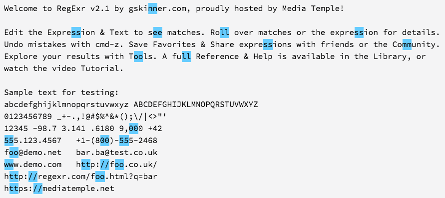

# Entry 2: Minimum Viable Product (MVP)

The coolest part about this app idea is that it will use an API to return an example/non-example related to the user's word using the Twinword API.  However, that's kind of an extra feature beyond the barebones of what this app should be able to do.  At the bare minimum, this app needs to determine whether or not the user's input can go through the Green Glass Door.  If I don't get that functionality, I can kiss this app goodbye.

## First attempt: a total failure

If you haven't figured it out by now, the rule the governs entry through the Green Glass Door hinges (pun intended) on double letters.  For example, a ha**mm**er can go through the Green Glass Door because of the double **m**s.  But a nail cannot, since there are no consecutive repeat letters.

Yeah, but how do I do this using Ruby? It can't be that hard, right? I first thought about doing something like this:

```ruby
def doubles?(word)
  word_array = word.split("") # break the word up into letters
  for i in 0..(word.length) do # go through each index of the new array
    if word_array[i] == word_array[i-1] # compare each letter to the previous one
      return true
      break
    end
    return false
  end
end

doubles?("hammer")
```

This method returned `false`, even though it should have returned `true`.  I banged my head against a wall for (no pun intended this time) a while trying different things until I realized that there must be a regex formula that can do this for me.  (I still don't know why the method doesn't work; it's probably because I don't understand `for` loops like I do in Javascript, but the thought of a formulaic regex pattern doing this for me was more lucrative than diving deep into an already complicated method).

## Google + the right query = Regex to the rescue

When I googled "ruby double letters regex" I found a lot of related (but more complicated) questions that required more heavy (and unrelated) algorithms such as: 

- finding at most n consecutive patterns
- remove all consecutive letters from a string
- etc

All stackoverflow results (not surprising) were trying to show me something more complicated than what I needed.  So I changed my query: "ruby **detect** double letters regex".  After perusing the results, I came across this line of code in a post:

`if string =~ /(.)\1/`

I wasn't sure what it did, so I popped the `(.)\1` portion into [regexr.com](http://regexr.com) and voila!



The good news was that this was *way* simpler than what I was trying to do.  The bad news is that it didn't work at first.  I had to invert the boolean logic because for some reason it was always coming out opposite as the way I expected.  Also, lowercase letters are different than uppercase letters, but I don't want my Green Glass Door to be *that* picky.  A little `!` and `downcase` should do the trick:

```ruby
def ggd_test(item)
  !(/(.)\1/ !~ item.downcase)
end

ggd_test("hammer") #=> true
ggd_test("nail") #=> false
ggd_test("brooklyn") #=> true
ggd_test("staten island") #=> false
```

Bingo, bango, bongo.  This makes for a pretty simple model; all that was left is to build out the application controller and views, right?  Well, I forgot about something.  I needed the words "CAN" and "CAN'T" to come out of the model, as well as the colors green and red to style the css. About an hour later, my [model](https://github.com/brianmueller/green-glass-door/commit/b97848db772c2181944068c12d59cedecf112177), [controller](https://github.com/brianmueller/green-glass-door/commit/2b3e04fcf5553863000d6bca790ca4b3f3656aea), and [views](https://github.com/brianmueller/green-glass-door/commit/ba928c9ff95de7adbc7db61eca773dee46f68141) were done.

MVP: check. Now I'm ready to learn about APIs.

## Takeaways

1. If at first you don't succeed, Google.
2. Don't be afraid to modify your search query.
3. Think about the user's experience. I could have made the view say "true" or "false". But it **makes more sense from the user's perspective** to read "_____ can/can't go through the Green Glass Door".
