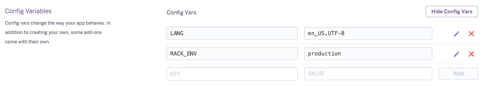

# Entry 4: Gitignore

You want to see my key?  I don't think so.

## Topic

Of my two last to-do's, I figured hiding my API key was the more urgent of the two tasks. After my usual cruise through the google-verse, I came across the concept of the **.gitignore** file.  My understanding of it is that you make the hidden `.gitignore` file and inside of it, you list any files that you don't want Git to include in your snapshots.  

The good news: this sounds like exactly what I want.
The bad news: my keys are in a file that I *do* want to be included in my snapshot.

## The hardest road to the best solution

I had to think ahead about this.  Knowing that I eventually wanted to deploy to heroku, I had to think about how heroku would get my keys as well.  In my searching for a way to extract the key and keep it hidden, I found lots of different ways that were incompatible with heroku.  Without heroku having the key, the app does not work.  There were workarounds to this problem, but a lot of them involved doing an extra step **every single time I deploy**.

When I first learned heroku, I used the command line.  After a little bit of setup, instead of pushing my code to Github with `git push` (the default remote/branch), I would do `git push heroku master`.  It's not that much more work to push twice, but considering how many commits I make (and the fact that most of the apps I make are small-scale and just for learning), I was pleased to learn when Heroku could connect to Github and listen for new commits to automatically deploy them.  It made for much more ease, but I knew having a hidden key would throw a wrench in this process.  It took a long time to find the best solution, but it yields the least headache in the long run.

My search queries evolved, each one slightly different based on the results from the previous search:

- heroku gitignore
- heroku gitignore api key
- heroku config variables
- cloud9 config variables
- cloud9 environment variables
- cloud9 api gitignore
- ruby api key heroku gitignore

Each search, I would skim multiple pages: documentation, stackoverflow posts, and tutorials.  It wasn't until the last one that I finally found a great tutorial giving me exactly what I needed:

[Hide Your Keys, Hide Your Tokens ... Unless Deploying to Heroku](http://gregeng.github.io/blog/2013/11/21/hide-your-keys/)

Would you look at that.  A blogger learning from another blogger.  This is why we do it!

The tricky thing about this solution was that it still utilized Heroku in the command line.  After a little more searching, Heroku allows you to setup your config/environment variables on the settings page of the web app.

The rest of the directions were pretty straightforward, except I needed to utilize the `dotenv` gem instead of the `dotenv-rails` gem (luckily it exists!).

## Summary

So in short, here's how it works.

1. In your `Gemfile`, include `gem 'dotenv'`.  This is a gem that will load config variables as actual strings.

2. At the top of your app (controller), `require 'dotenv/load'`.

3. Instead of putting your keys plainly in your model, you put them in a `.env` file in the root directory of your app, in this format:  
`KEYNAME=VALUE`  
No quotes.  And it's best to use all uppercase.

4. Wherever you want to use the `VALUE`, you just write `ENV["KEYNAME"]`.  In my case, it was:  
`ENV["TWINWORD_KEY"]`  

5. Make sure to write `/.env` in your `.gitignore` file.

6. I'll get to this step later, but you'll have to setup your config vars in heroku as well when you're ready to deploy.  

7. Make sure you also put your keys somewhere safe because you won't be able to find them on Github if you lose your local copy of your repo.

Done.

## Sidenote: Test to get the Best

I was so pumped after getting the API to work last week that of course I've been showing friends and family.  The beauty is that I can say "Go ahead, type in *any* singular noun."  While the "can/can't" is always correct, and the word given back as an example/non-example *is* associated to the user's word, I'm finding that the returned word isn't always a noun.  It doesn't make sense for adjectives, verbs, adverbs, etc. to go (or even not go) through the Green Glass Door.

For example,
> A(n) **calendar** can't go through the Green Glass Door, but a(n) **biweekly** can.  

doesn't make sense.  The model already goes through the returned array of words and finds an example/non-example, but I also need to add some logic that uses nouns only.

I probably wouldn't have noticed this flaw if I hadn't shown it off because the words I was testing *just so happened* to always give back nouns.  But I'm realizing that a *good* app can't depend on "just so happened."  I guess this is why software goes through alpha and beta stages first.

## Takeaways

1. Taking time to find the best solution can sometimes be worth the time it takes to find it (and figure it out).
2. Testing out the app with friends and family will help reveal bugs in order to get the best possible app that both 1) works, and 2) makes sense.

## To-Do
1. Add noun filter.
2. Set up config vars when I deploy.

[Previous](entry03-twinword.md)  |  Next

[Table of Contents](../README.md)
